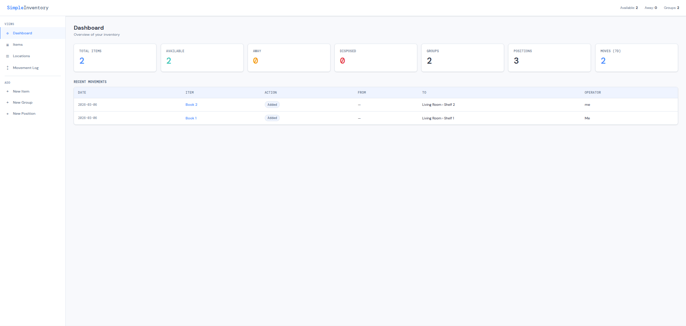
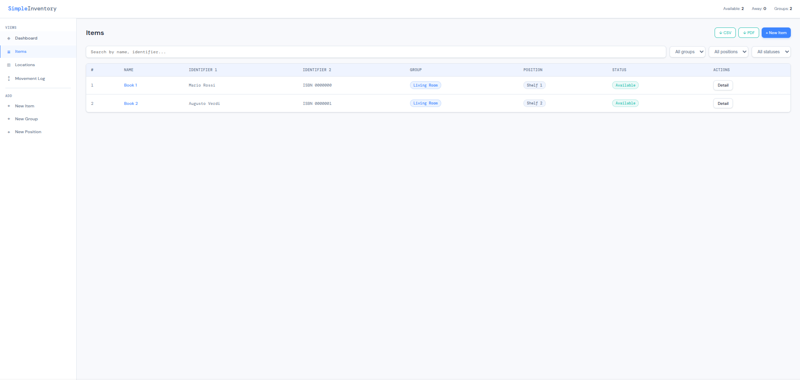
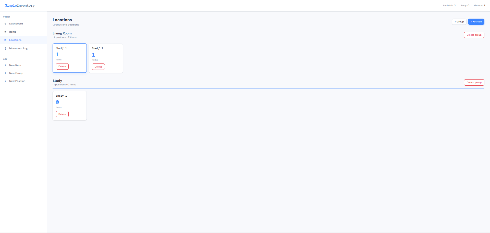

# SimpleInventory

A lightweight, self-hosted inventory management web app built with Python (Flask) and SQLite. No external database or complex setup required — everything lives in a single `.db` file.

   

## Features

- **Hierarchical locations** — organize items by Group → Position (e.g. *Library A → Shelf 3*)
- **Flexible item fields** — name + two optional identifiers (ISBN, serial, SKU, etc.) + notes
- **Movement tracking** — every move, checkout, return or disposal is logged with date and operator
- **Date-aware log** — filter movement history by date range
- **Export** — CSV and PDF reports for both inventory snapshot and movement log
- **Configurable labels** — rename identifier fields and app title via `config.json`
- **Zero dependencies** beyond Python stdlib + Flask + ReportLab

## Screenshots
<p>
  
  
  
</p>

## Quick Start

```bash
# Clone the repo
git clone https://github.com/yourusername/simpleinventory
cd simpleinventory

# Create virtual environment
python -m venv venv
source venv/bin/activate        # Linux / macOS
# venv\Scripts\activate         # Windows

# Install dependencies
pip install -r requirements.txt

# Run
python app.py
```

Open your browser at **http://localhost:5000**

The database (`inventory.db`) is created automatically on first run.

## Configuration

All user-facing labels and the app title are set in **`config.json`**, which lives in the project root. Edit it before starting the app — changes take effect on the next restart.

```json
{
  "app_name":  "SimpleInventory",
  "id1_label": "Identifier 1",
  "id2_label": "Identifier 2"
}
```

If `config.json` is missing or a key is absent, the app falls back to the defaults shown above — so it works out of the box without any configuration.

### Examples

**Book library:**
```json
{
  "app_name":  "My Library",
  "id1_label": "ISBN",
  "id2_label": "Author"
}
```

**Electronics / parts room:**
```json
{
  "app_name":  "Parts Room",
  "id1_label": "Part Number",
  "id2_label": "Serial"
}
```

**Tool shed:**
```json
{
  "app_name":  "Tool Inventory",
  "id1_label": "Model",
  "id2_label": "Brand"
}
```

## Concepts

| Concept | Description |
|---|---|
| **Group** | Top-level container (e.g. *Bookshelf*, *Warehouse A*, *Cabinet 2*) |
| **Position** | A slot within a group (e.g. *Row 1*, *Shelf B*, *Box 3*) |
| **Item** | A physical object tracked by name + optional identifiers |
| **Movement** | Any state change: added, moved, checked out, returned, disposed |

### Item statuses

| Status | Meaning |
|---|---|
| `available` | Item is in its assigned position |
| `away` | Item has been checked out / is not currently in storage |
| `disposed` | Item has been removed from inventory |

## Project structure

```
simpleinventory/
├── app.py              # Flask backend + API routes + PDF generation
├── config.json         # User configuration (labels, app name)
├── templates/
│   └── index.html      # Single-page frontend (HTML + CSS + JS)
├── inventory.db        # SQLite database (auto-created, git-ignored)
├── requirements.txt
├── .gitignore
└── README.md
```

## Running as a systemd service (Linux)

Create `~/.config/systemd/user/simpleinventory.service` (user service, no sudo needed):

```ini
[Unit]
Description=SimpleInventory
After=network.target

[Service]
WorkingDirectory=/path/to/simpleinventory
ExecStart=/path/to/simpleinventory/venv/bin/python app.py
Restart=on-failure

[Install]
WantedBy=default.target
```

```bash
systemctl --user daemon-reload
systemctl --user enable simpleinventory
systemctl --user start simpleinventory
```

## Dependencies

```
flask
reportlab
```

Install with: `pip install -r requirements.txt`

## License

MIT — do whatever you want with it.
